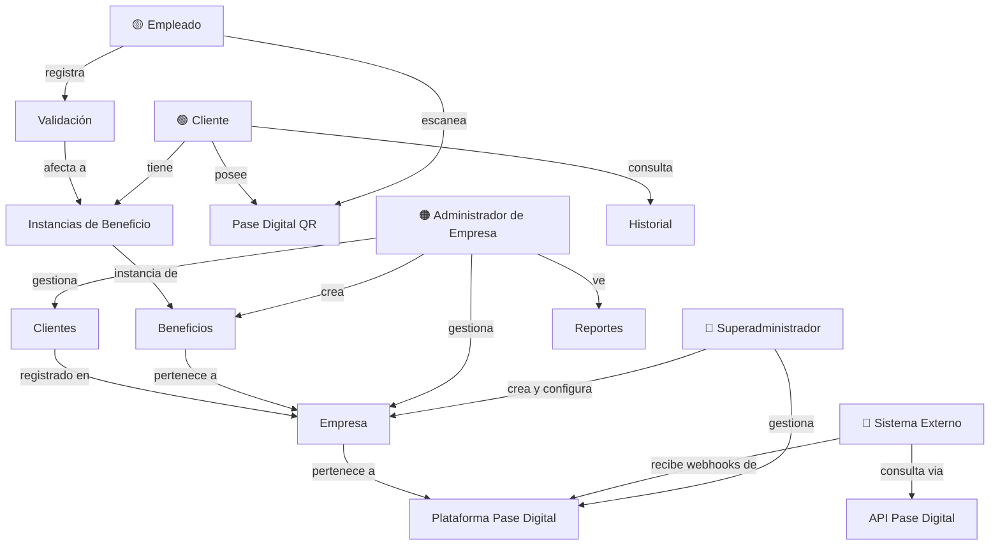
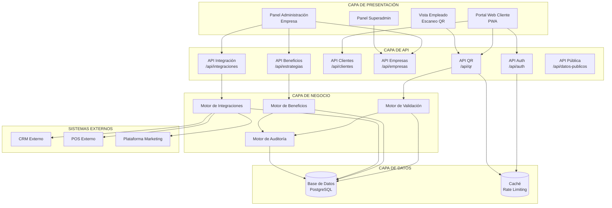
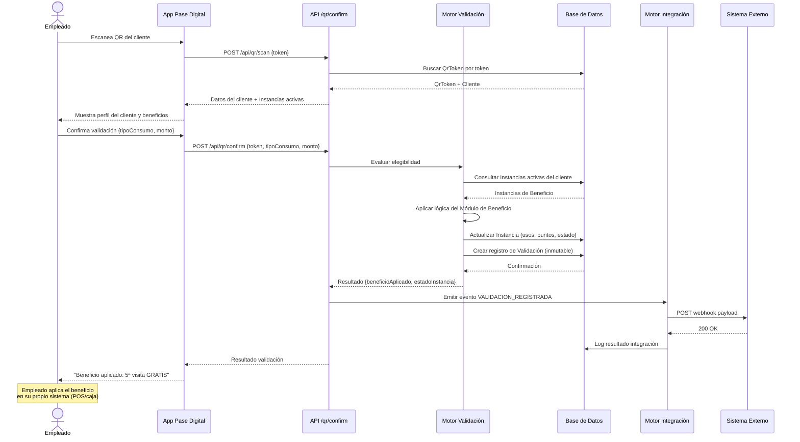
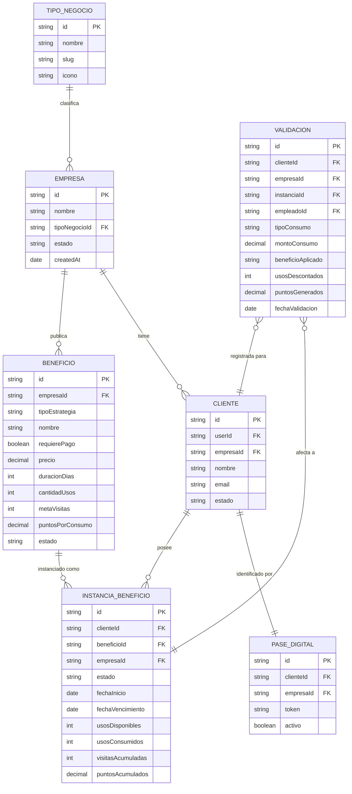
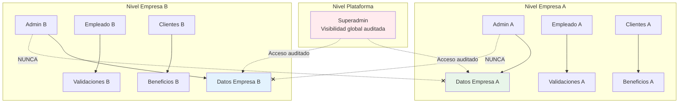

# Product Architecture Document (PAD)
## Pase Digital — Plataforma de Administración de Beneficios Digitales

---

**Documento:** PAD-001  
**Versión:** 1.0.0  
**Estado:** Activo — Fuente Oficial de Verdad  
**Clasificación:** Interno — Equipo de Arquitectura y Producto  
**Última actualización:** 2026-06-26  
**Propietario:** Equipo de Arquitectura de Pase Digital  

---

> *Este documento es la Constitución oficial del producto. Toda decisión de diseño, desarrollo, integración o expansión debe alinearse con los principios, conceptos y arquitectura aquí definidos. En caso de conflicto entre este documento y cualquier otro artefacto del proyecto, este documento prevalece.*

---

## Tabla de Contenidos

1. [Introducción](#1-introducción)
2. [Visión](#2-visión)
3. [Misión](#3-misión)
4. [Objetivos Estratégicos](#4-objetivos-estratégicos)
5. [Filosofía del Producto](#5-filosofía-del-producto)
6. [Conceptos Oficiales y Glosario](#6-conceptos-oficiales-y-glosario)
7. [Alcance del Producto](#7-alcance-del-producto)
8. [Taxonomía de Beneficios](#8-taxonomía-de-beneficios)
9. [Actores del Sistema](#9-actores-del-sistema)
10. [Casos de Uso Principales](#10-casos-de-uso-principales)
11. [Arquitectura Conceptual](#11-arquitectura-conceptual)
12. [Principios de Escalabilidad](#12-principios-de-escalabilidad)
13. [Riesgos del Proyecto](#13-riesgos-del-proyecto)
14. [Decisiones Arquitectónicas](#14-decisiones-arquitectónicas)
15. [Roadmap General](#15-roadmap-general)
16. [Autoauditoría del Documento](#16-autoauditoría-del-documento)

---

## 1. Introducción

### 1.1 ¿Qué es Pase Digital?

**Pase Digital** es una plataforma SaaS especializada en la administración de beneficios digitales para múltiples empresas y múltiples industrias.

La plataforma permite que cualquier negocio — desde una barbería hasta una cadena de restaurantes — defina, publique, distribuya y valide beneficios para sus clientes: descuentos, membresías, cupones, planes de visitas, promociones temporales, beneficios por consumo, programas VIP y cualquier variante futura, todo dentro de una misma arquitectura flexible y extensible.

El mecanismo central es simple y universal: **cada cliente recibe un código QR único que lo identifica**. Cuando ese cliente visita un establecimiento, un empleado escanea el QR. La plataforma evalúa en tiempo real si ese cliente tiene derecho a recibir algún beneficio. La empresa aplica el beneficio en su propio sistema. Pase Digital registra la validación y emite un comprobante inmutable.

El QR no contiene información sobre beneficios. No contiene saldo. No tiene lógica propia. Es únicamente un identificador de identidad. **Toda la inteligencia vive en la nube.**

### 1.2 ¿Qué problema resuelve?

Hoy, la mayoría de los negocios que intentan implementar programas de beneficios para sus clientes enfrentan uno o más de los siguientes problemas:

| Problema | Descripción |
|---|---|
| **Fragmentación** | Los beneficios están dispersos en tarjetas físicas, hojas de cálculo, apps propias mal mantenidas o sistemas obsoletos. |
| **Rigidez** | Los sistemas de fidelización existentes solo soportan un tipo de beneficio (generalmente puntos), obligando a las empresas a adaptarse al sistema en lugar de al revés. |
| **Dependencia tecnológica** | Implementar un programa de beneficios requiere reemplazar o modificar el sistema operativo del negocio (POS, ERP), lo cual es costoso, riesgoso y lento. |
| **Cero auditoría** | No existe trazabilidad clara de qué beneficio fue aplicado, cuándo, por quién y a quién. |
| **Escala limitada** | Las soluciones actuales no están diseñadas para crecer: agregar un nuevo tipo de beneficio o una nueva sucursal implica rediseñar el sistema. |
| **Experiencia pobre para el cliente** | Las tarjetas de membresía se pierden. Las apps propietarias de negocios locales no se usan. Los cupones en papel se olvidan. |

Pase Digital resuelve todos estos problemas con una plataforma unificada, flexible y agnóstica al software operativo del negocio.

### 1.3 ¿Qué NO pretende hacer Pase Digital?

Es tan importante definir los límites del sistema como definir sus capacidades. Pase Digital **no es** y **no pretende ser**:

- **Un sistema de punto de venta (POS):** No procesa ventas, no emite facturas, no cobra al cliente.
- **Un sistema de gestión empresarial (ERP):** No administra inventario, nómina, contabilidad ni operaciones internas del negocio.
- **Una pasarela de pagos:** No procesa pagos de clientes a empresas. No es un intermediario financiero.
- **Una aplicación de mensajería o marketing masivo:** No es una plataforma de email marketing ni de push notifications como canal primario.
- **Un marketplace:** No conecta compradores con vendedores. No cobra comisiones sobre transacciones comerciales.
- **Un sustituto del CRM del negocio:** No reemplaza las herramientas de gestión de relaciones con clientes que cada empresa ya utiliza.

Esta delimitación es intencional. Al no intentar hacerlo todo, la plataforma puede hacer lo que hace de manera excepcional: **validar y administrar beneficios con precisión, flexibilidad y auditoría completa**.

---

## 2. Visión

### 2.1 Declaración de Visión

> *Ser la infraestructura global estándar sobre la cual cualquier empresa — sin importar su tamaño, industria o sistema operativo — pueda construir, distribuir y administrar beneficios digitales para sus clientes.*

### 2.2 Expansión de la Visión (Horizonte 10 años)

En el año 2035, Pase Digital será la capa de beneficios del comercio local y regional, de la misma manera que Stripe es la capa de pagos o Twilio la capa de comunicaciones. Las empresas no pensarán en "construir un programa de fidelización" — pensarán en "conectar Pase Digital".

**Horizonte 1 (2026–2027): Dominio local**  
Pase Digital se convierte en la referencia del mercado local dominicano para administración de beneficios digitales. Más de 500 empresas activas. Más de 50,000 clientes con Pases activos. Arquitectura multitenant validada en producción.

**Horizonte 2 (2028–2030): Expansión regional**  
La plataforma escala a mercados de América Latina y el Caribe. Se lanzan módulos de integración con los POS y ERPs más utilizados de la región. Aparece el primer ecosistema de partners certificados. El Motor de Validación procesa más de 1 millón de validaciones mensuales.

**Horizonte 3 (2031–2035): Infraestructura global**  
Pase Digital opera como infraestructura agnóstica a la industria. Cualquier empresa en cualquier país puede conectarse a través de la API pública. El sistema es capaz de representar cualquier tipo de beneficio imaginable a través de la arquitectura extensible de Módulos de Beneficio. Más de 10,000 empresas activas. La plataforma es rentable y auto-escalable.

---

## 3. Misión

### 3.1 Declaración de Misión

> *Democratizar el acceso a programas de beneficios digitales de clase empresarial para cualquier negocio, eliminando la fricción tecnológica entre las empresas y sus clientes.*

### 3.2 Elaboración

La misión se sustenta en tres pilares:

**Democratización:** Hoy, los programas de beneficios sofisticados están reservados para grandes cadenas con departamentos de tecnología propios. Una barbería independiente, una pizzería familiar o un spa no tienen acceso a esa infraestructura. Pase Digital nivelaría el campo.

**Eliminación de fricción tecnológica:** El mayor enemigo de la adopción no es el precio, sino la complejidad de implementación. Pase Digital debe poder implementarse en cualquier negocio en menos de 24 horas sin modificar ningún sistema existente.

**Clase empresarial:** La plataforma debe ofrecer el mismo nivel de auditoría, seguridad y confiabilidad que esperan las grandes corporaciones, empaquetado de forma que lo pueda usar cualquier negocio.

---

## 4. Objetivos Estratégicos

### 4.1 Corto Plazo (2026)

| # | Objetivo | Indicador de éxito |
|---|---|---|
| OC-01 | Lanzar la plataforma en producción estable con soporte para todos los tipos de beneficio base | Build verde en Vercel, cero errores críticos en producción durante 30 días |
| OC-02 | Incorporar los primeros 50 negocios activos en la plataforma | 50 empresas con al menos 1 beneficio activo y al menos 10 clientes |
| OC-03 | Alcanzar 5,000 validaciones exitosas de beneficios | Dashboard de métricas confirma 5,000 registros de validación |
| OC-04 | Implementar el sistema de integraciones webhooks con al menos 2 sistemas externos | Logs de integración sin errores para 2 sistemas en producción |
| OC-05 | Establecer la documentación técnica completa (PAD, SDD, API Spec) | Documentos publicados y aprobados en `/docs/` |

### 4.2 Mediano Plazo (2027–2028)

| # | Objetivo | Indicador de éxito |
|---|---|---|
| OM-01 | Lanzar la API pública v1 para integraciones de terceros | Documentación pública, SDK disponible, primeros 10 integradores externos |
| OM-02 | Implementar el módulo de Sucursales (empresas con múltiples ubicaciones) | Al menos 5 cadenas con más de 3 sucursales activas |
| OM-03 | Desarrollar el motor de campañas temporales programadas | Campañas automáticas ejecutadas sin intervención manual |
| OM-04 | Incorporar módulo de análisis y reportes avanzados | Dashboard con métricas de conversión, retención y ROI de beneficios |
| OM-05 | Expandir a 2 mercados adicionales de América Latina | Empresas activas en al menos 2 países fuera de la República Dominicana |

### 4.3 Largo Plazo (2029–2035)

| # | Objetivo | Indicador de éxito |
|---|---|---|
| OL-01 | Posicionar Pase Digital como infraestructura estándar de beneficios en LATAM | Reconocimiento de marca medido por encuestas de industria |
| OL-02 | Lanzar el Marketplace de Módulos de Beneficio (desarrolladores externos pueden publicar módulos) | Al menos 20 módulos de terceros disponibles |
| OL-03 | Implementar soporte multi-divisa y multi-idioma nativo | Plataforma funcional en inglés, español y portugués con divisas locales |
| OL-04 | Alcanzar 10,000 empresas activas | Métricas de facturación y uso |
| OL-05 | Certificaciones de seguridad internacionales (SOC 2 Type II, ISO 27001) | Certificados emitidos y públicamente verificables |

---

## 5. Filosofía del Producto

Los siguientes principios son vinculantes. Toda decisión de producto y arquitectura debe poder justificarse en función de uno o más de estos principios. Cuando dos decisiones estén en conflicto, estos principios sirven como árbitro.

---

### P-01 · El QR es identidad, no beneficio

El código QR que posee cada cliente contiene únicamente un token que identifica al cliente dentro de la plataforma. No contiene saldo, no contiene puntos, no contiene cupones, no contiene ningún tipo de valor. El QR es un pasaporte de identidad digital. Los beneficios existen en la nube, vinculados a esa identidad.

**Por qué importa:** Si el QR contuviese el beneficio, sería falsificable, tendría un estado local difícil de sincronizar, y su validez dependería de la integridad del dispositivo que lo genera. Al separar identidad de beneficio, la plataforma mantiene control total sobre la lógica de validación.

---

### P-02 · Toda validación es inmutable

Cuando un beneficio es validado, ese evento queda registrado de forma permanente e inalterable en la plataforma. No puede ser eliminado. No puede ser modificado retroactivamente. Puede ser auditado en cualquier momento por cualquier actor autorizado.

**Por qué importa:** La confianza es el activo más valioso de la plataforma. Las empresas necesitan saber que no habrá manipulación de registros. Los clientes necesitan saber que sus beneficios no desaparecerán arbitrariamente.

---

### P-03 · La plataforma valida; la empresa aplica

Pase Digital determina si un cliente tiene derecho a un beneficio. La empresa recibe esa confirmación y aplica el beneficio en su propio sistema (POS, caja registradora, sistema de reservas, etc.). La plataforma no ejecuta el beneficio dentro del sistema del negocio, no descuenta de una caja, no emite una factura. Este principio garantiza la independencia operativa de cada empresa.

**Por qué importa:** Intentar integrarse profundamente con el sistema operativo de cada empresa crea una dependencia técnica masiva, eleva el costo de implementación y reduce la velocidad de adopción. Al ser el árbitro de la validación y no el ejecutor del cobro, la plataforma puede integrarse con cualquier negocio independientemente del sistema que utilice.

---

### P-04 · Toda acción deja evidencia

No existe acción en la plataforma que no genere un registro auditable. Crear un beneficio, modificarlo, asignarlo a un cliente, validarlo, vencerlo, revertirlo — todo tiene un registro con actor, timestamp y contexto. Ninguna operación es silenciosa.

**Por qué importa:** La auditoría no es un accesorio, es la columna vertebral de la confianza. En el mundo de los beneficios, la tentación de manipular registros existe tanto del lado de la empresa como del empleado. La evidencia permanente disuade y protege.

---

### P-05 · La empresa conserva el control total de sus beneficios

Ninguna entidad externa — incluyendo el operador de la plataforma (Superadmin) — puede modificar o aplicar un beneficio perteneciente a una empresa sin autorización explícita de dicha empresa. Las empresas son soberanas dentro de su espacio en la plataforma.

**Por qué importa:** La plataforma es un proveedor de servicio, no un intermediario con poder editorial sobre los beneficios de sus clientes.

---

### P-06 · La flexibilidad es un requerimiento de primer nivel

El sistema de beneficios no puede ser una lista cerrada de tipos predefinidos. La arquitectura debe permitir que nuevos tipos de beneficios sean incorporados sin modificar el núcleo del sistema. Un beneficio puede ser tan simple como "5% de descuento" o tan complejo como "después de 10 lavados de auto, el 11° es gratis y viene con fragancia incluida, siempre que el cliente haya comprado el Plan Oro". Toda esa lógica debe poder ser representada.

**Por qué importa:** El mercado evoluciona. Los competidores innovan. Si la plataforma solo soporta cupones y puntos en 2026, habrá quedado obsoleta para 2028.

---

### P-07 · La plataforma es agnóstica a la industria

No existe ninguna asunción sobre el tipo de negocio que usa la plataforma. Un hotel, una gasolinera, un gimnasio, una clínica dental, una librería — todos pueden usar exactamente la misma plataforma. Los conceptos son suficientemente universales como para aplicarse a cualquier industria.

**Por qué importa:** La especialización en una industria limita el mercado direccionable. La arquitectura genérica bien diseñada sirve a todas las industrias mejor de lo que una arquitectura especializada sirve a una sola.

---

### P-08 · La experiencia del cliente es el producto visible

Para el usuario final (el cliente del negocio), la plataforma se reduce a un QR y a los beneficios que recibe. Todo el trabajo técnico debe estar invisibilizado detrás de una experiencia simple, rápida y confiable. El cliente no sabe ni debe saber qué tan compleja es la infraestructura detrás.

**Por qué importa:** La adopción por parte de los clientes finales es el único indicador de éxito verdadero de la plataforma. Un sistema técnicamente perfecto que los clientes no usan ha fracasado.

---

### P-09 · La seguridad no es negociable

Todos los tokens de identificación son criptográficamente seguros. Todas las sesiones están firmadas. Todas las comunicaciones van cifradas. El sistema implementa protección contra abuso de tasa (rate limiting), validación de entradas y separación estricta de permisos por empresa. La seguridad se diseña desde el inicio, no se añade al final.

**Por qué importa:** Un solo incidente de seguridad puede destruir la confianza de todas las empresas en la plataforma. La seguridad es una característica de producto, no una preocupación del equipo de infraestructura.

---

### P-10 · Los datos de una empresa son invisibles para otras empresas

El aislamiento de datos entre empresas (multitenancy) es absoluto. Una empresa nunca puede, por ninguna vía técnica ni de interfaz, acceder a clientes, beneficios, validaciones o métricas de otra empresa. El Superadmin tiene visibilidad técnica pero opera con controles de acceso auditados.

**Por qué importa:** La violación de este principio sería un incidente catastrófico de privacidad que destruiría la plataforma. Es un requerimiento de cumplimiento, no solo de diseño.

---

### P-11 · La simplicidad operativa es una ventaja competitiva

Implementar la plataforma en un negocio no debe requerir hardware especializado, software adicional, ni formación técnica extensa. Un empleado debe poder aprender a escanear un QR y registrar una validación en menos de 10 minutos. Una empresa debe poder publicar su primer beneficio en menos de 30 minutos desde el registro.

**Por qué importa:** La velocidad de adopción es directamente proporcional a la simplicidad. Cada punto de fricción en el onboarding reduce la tasa de activación.

---

### P-12 · La plataforma no debe ser el cuello de botella operativo

Si la plataforma no está disponible, el negocio no debe detenerse. Los diseños de degradación graceful (modo offline, colas de sincronización, respuestas optimistas) deben considerarse en la arquitectura de cara a los escenarios de mayor disponibilidad requerida.

**Por qué importa:** Un restaurante que no puede validar un beneficio porque el servicio está caído perderá confianza en la plataforma inmediatamente. La resiliencia es un requisito de adopción masiva.

---

## 6. Conceptos Oficiales y Glosario

Este glosario define la terminología canónica del proyecto. Todo documento, código, comunicación y decisión debe utilizar estos términos de forma consistente. Los sinónimos coloquiales que puedan generar ambigüedad están explícitamente desaconsejados.

---

### 6.1 Entidades Primarias

#### Empresa
**Definición:** Organización registrada en la plataforma que publica y administra beneficios para sus clientes.  
**Características:** Tiene un nombre, identidad visual, tipo de negocio, empleados, beneficios y clientes propios. Opera de forma completamente aislada de otras empresas. Una empresa puede tener una o múltiples sucursales.  
**Sinónimos desaconsejados:** negocio, cuenta, organización, tenant.  
**Nota técnica:** En el modelo de datos, es la entidad `Empresa`. Es la unidad de aislamiento de datos en el modelo multitenant.

#### Sucursal
**Definición:** Ubicación física o canal específico de operación perteneciente a una Empresa.  
**Características:** Una empresa puede tener múltiples sucursales (ej. Barbería Norte, Barbería Centro). Los beneficios pueden ser globales (válidos en cualquier sucursal) o específicos de sucursal. Los empleados pertenecen a una sucursal.  
**Sinónimos desaconsejados:** sede, local, punto de venta.  
**Nota:** La arquitectura de Sucursales está planificada para el Horizonte 2. En la versión 1.0, cada empresa opera como una sola unidad sin subdivisión por sucursal.

#### Cliente
**Definición:** Persona física que se registra en la plataforma a través de una Empresa y recibe un Pase Digital.  
**Características:** Un cliente puede estar registrado en múltiples empresas simultáneamente, teniendo un Pase Digital diferente para cada una. Su identidad central (email, nombre) es única en la plataforma, pero su perfil de beneficios es específico de cada empresa en la que está registrado.  
**Sinónimos desaconsejados:** usuario, miembro, socio, portador.  
**Nota técnica:** En el modelo de datos, se distingue `User` (la cuenta de autenticación) del `Cliente` (el perfil dentro de una empresa). Un `User` puede tener múltiples registros `Cliente`.

#### Empleado
**Definición:** Persona autorizada por una Empresa para ejecutar validaciones de beneficios en nombre de esa empresa.  
**Características:** Tiene acceso limitado a la plataforma: puede escanear QRs, registrar validaciones y consultar historial. No puede modificar beneficios ni acceder a información de gestión. Pertenece a una sola empresa (y eventualmente a una sucursal).  
**Sinónimos desaconsejados:** operador, cajero, usuario interno.

#### Administrador de Empresa
**Definición:** Usuario con rol de gestión dentro de una Empresa. Puede crear y modificar beneficios, gestionar clientes, ver reportes y configurar la empresa.  
**Sinónimos desaconsejados:** dueño, manager, responsable.

#### Superadministrador
**Definición:** Operador de la plataforma Pase Digital con acceso técnico global. Puede crear empresas, ver métricas globales y gestionar configuración de la plataforma. No tiene privilegios sobre los datos operativos de beneficios de empresas individuales sin registro de auditoría.  
**Sinónimos desaconsejados:** root, admin global, superusuario.

---

### 6.2 Artefactos del Sistema de Beneficios

#### Beneficio
**Definición:** La unidad fundamental de valor que una Empresa ofrece a sus Clientes. Es la definición abstracta y reutilizable de qué se ofrece, bajo qué condiciones y con qué lógica de activación.  
**Componentes:** Tipo de beneficio, condiciones de elegibilidad, reglas de validación, duración, límites de uso, precio (si aplica), y recompensa específica.  
**Nota:** Un Beneficio es una *plantilla*. Cuando se asigna a un cliente, se convierte en una **Instancia de Beneficio**.  
**Sinónimos desaconsejados:** promoción (término demasiado estrecho), fidelización (categoría, no concepto), producto.

#### Instancia de Beneficio
**Definición:** La materialización de un Beneficio asignado a un Cliente específico. Tiene estado, historial propio, fechas de inicio y vencimiento, y contadores de uso.  
**Características:** Una Instancia de Beneficio puede estar en estado `PENDIENTE_PAGO`, `ACTIVA`, `AGOTADA`, `VENCIDA` o `CANCELADA`. Es la entidad que el Motor de Validación evalúa en el momento del escaneo.  
**Nota técnica:** En el modelo de datos, corresponde a la entidad `ClienteEstrategia`.  
**Sinónimos desaconsejados:** membresía activa, cupón del cliente (demasiado específicos).

#### Validación
**Definición:** El acto formal de verificar que un Cliente tiene derecho a recibir un Beneficio en un momento dado, y el registro permanente de ese acto.  
**Características:** Una Validación incluye: quién validó (empleado), qué cliente, en qué empresa, qué beneficio aplicó, cuándo, el tipo de consumo registrado, el monto si aplica, y el resultado (beneficio aplicado o consumo regular).  
**Nota técnica:** En el modelo de datos, corresponde a la entidad `Transaccion`.  
**Sinónimos desaconsejados:** uso, canje, transacción (término demasiado financiero para este contexto).

#### Comprobante de Validación
**Definición:** El registro auditable e inmutable generado por cada Validación. Contiene todos los datos del evento de validación y sirve como evidencia formal tanto para la empresa como para el cliente.  
**Nota:** El Comprobante no es una factura ni un recibo de cobro. Es un certificado de que la plataforma evaluó y confirmó (o no) un beneficio en un momento específico.

#### Pase Digital
**Definición:** La representación digital de la identidad de un Cliente dentro de una Empresa, expresada como un código QR. Es el artefacto que el cliente presenta para iniciar una Validación.  
**Características:** Es único por cliente por empresa. Contiene un token criptográficamente generado que no revela información personal. Puede ser regenerado (invalidando el anterior) sin afectar las Instancias de Beneficio del cliente.  
**Sinónimos desaconsejados:** tarjeta de fidelización, QR de membresía.

#### Campaña
**Definición:** Un conjunto de Beneficios agrupados bajo un objetivo de negocio temporal o temático. Una Campaña puede tener fechas de inicio y fin, un presupuesto de cupos, y condiciones de elegibilidad globales que complementan las de cada Beneficio individual.  
**Ejemplo:** "Campaña de Verano 2027" que agrupa 3 beneficios distintos disponibles solo durante julio y agosto.  
**Nota:** Las Campañas son un concepto de organización y presentación; la lógica de validación sigue perteneciendo a cada Beneficio individual.

#### Plan
**Definición:** Un tipo especial de Beneficio que tiene precio, duración definida y un conjunto de privilegios o servicios incluidos. Un Plan es esencialmente una Membresía con una propuesta de valor explícita y un costo.  
**Ejemplo:** "Plan Oro — RD$500/mes — Incluye 4 lavados y 2 aromatizaciones."  
**Sinónimos desaconsejados:** suscripción (tiene connotaciones de renovación automática que el sistema puede o no soportar).

#### Oferta
**Definición:** Un Beneficio con naturaleza específicamente comercial y temporal: un precio especial, un descuento por tiempo limitado, o un paquete de servicios a precio reducido. Se diferencia de un cupón en que una Oferta puede ser accedida por múltiples clientes simultáneamente y tiene métricas de conversión.  
**Ejemplo:** "2x1 en lavados los martes de agosto."

---

### 6.3 Componentes del Sistema

#### Motor de Validación
**Definición:** El componente central de la plataforma responsable de evaluar, en tiempo real, si un Cliente tiene derecho a recibir un Beneficio cuando su Pase Digital es escaneado.  
**Características:** Recibe como entrada el token del QR, el contexto del escaneo (empresa, empleado, timestamp), y opcionalmente el identificador de un Beneficio específico. Devuelve la determinación de elegibilidad, el beneficio aplicado y los metadatos de la validación.  
**Invariantes:** Es completamente sin estado (stateless) en su evaluación. No guarda datos internos entre llamadas. Toda su inteligencia proviene de consultar las Instancias de Beneficio del cliente en la base de datos.

#### Motor de Beneficios
**Definición:** El componente responsable de gestionar el ciclo de vida de los Beneficios: creación, activación, modificación, vencimiento automático, agotamiento de cupos y cancelación.  
**Responsabilidades:** Ejecuta las reglas de vencimiento por fecha o por uso agotado. Dispara eventos hacia el sistema de integraciones cuando un Beneficio cambia de estado. Calcula el estado actual de cualquier Instancia de Beneficio.

#### Sistema de Integraciones
**Definición:** El componente que permite que la plataforma notifique a sistemas externos sobre eventos relevantes (cliente registrado, beneficio validado, membresía activada, etc.) mediante webhooks configurables.  
**Nota:** La integración es unidireccional por defecto (Pase Digital → sistema externo). Las integraciones bidireccionales (sistemas externos que modifican el estado de la plataforma) están planificadas para el Horizonte 2 con autenticación reforzada.

#### Módulo de Beneficio
**Definición:** La unidad de extensibilidad del Motor de Beneficios. Cada tipo de beneficio (Membresía, Conteo de Visitas, Cupón, Puntos, Promoción Temporal, etc.) está implementado como un Módulo independiente con una interfaz estándar. Nuevos tipos de beneficio se agregan creando nuevos Módulos sin modificar el núcleo.  
**Sinónimos desaconsejados:** plugin, tipo de estrategia.

#### Tipo de Negocio
**Definición:** Una clasificación predefinida de la industria a la que pertenece una Empresa (Carwash, Restaurante, Barbería, Spa, etc.). Determina los Campos Dinámicos disponibles para los perfiles de clientes y puede influir en la presentación de los Beneficios.

#### Campo Dinámico
**Definición:** Un atributo adicional del perfil de un Cliente, específico del Tipo de Negocio de su Empresa. Permite capturar información relevante para la industria: modelo de vehículo para un carwash, tipo de membresía para un gimnasio, preferencias para un restaurante.

---

## 7. Alcance del Producto

### 7.1 Qué hace la plataforma

```
┌─────────────────────────────────────────────────────────────────┐
│                    DENTRO DEL ALCANCE                           │
├─────────────────────────────────────────────────────────────────┤
│ ✓ Registro y autenticación de empresas, empleados y clientes    │
│ ✓ Creación y configuración de cualquier tipo de beneficio       │
│ ✓ Generación y gestión de Pases Digitales (QR)                 │
│ ✓ Validación de beneficios mediante escaneo de QR              │
│ ✓ Registro inmutable de todas las validaciones                  │
│ ✓ Gestión del ciclo de vida de Instancias de Beneficio          │
│ ✓ Notificaciones a sistemas externos vía webhooks               │
│ ✓ Reportes y métricas por empresa                               │
│ ✓ Configuración de campos dinámicos por tipo de negocio        │
│ ✓ Panel de administración por empresa                           │
│ ✓ Panel de control para el cliente (ver beneficios, historial)  │
│ ✓ Soporte para múltiples empresas en una misma plataforma       │
│ ✓ Gestión de pagos de planes (confirmación manual)              │
│ ✓ API pública para integraciones de terceros (v2)               │
└─────────────────────────────────────────────────────────────────┘
```

### 7.2 Qué NO hace la plataforma

```
┌─────────────────────────────────────────────────────────────────┐
│                    FUERA DEL ALCANCE                            │
├─────────────────────────────────────────────────────────────────┤
│ ✗ Procesamiento de pagos entre cliente y empresa                │
│ ✗ Emisión de facturas o comprobantes fiscales                   │
│ ✗ Gestión de inventario del negocio                             │
│ ✗ Administración de nómina o RRHH                               │
│ ✗ Gestión contable                                              │
│ ✗ Sistema de reservas o agendamiento                            │
│ ✗ Envío de campañas de email marketing masivo                   │
│ ✗ Delivery o logística de pedidos                               │
│ ✗ Ejecución del beneficio en el sistema del negocio             │
│ ✗ Garantía del servicio prometido por el negocio                │
│ ✗ Mediación de disputas entre empresa y cliente                 │
│ ✗ Almacenamiento de datos de tarjetas de crédito                │
└─────────────────────────────────────────────────────────────────┘
```

### 7.3 Áreas limítrofes (requieren decisión caso a caso)

Estas áreas no están ni claramente dentro ni claramente fuera del alcance. Cada expansión en estas áreas requiere una decisión documentada del equipo de arquitectura:

| Área | Estado actual | Consideración |
|---|---|---|
| Notificaciones push al cliente | Fuera | Alta demanda de mercado. Podría integrarse como módulo opcional. |
| Comunicación SMS al cliente | Fuera | Depende de proveedor externo. Alta fricción operativa. |
| Pasarela de pagos para planes | Parcial (confirmación manual) | La confirmación automática de pagos requiere integración con pasarela. Planificado para Horizonte 2. |
| Portal público de beneficios de la empresa | Parcial | La landing page actual muestra empresas y beneficios públicos. Puede expandirse a una microsite por empresa. |
| App móvil nativa | Fuera | La PWA cubre las necesidades actuales. Evaluar en función de adopción. |
| Programa de referidos | Fuera | Lógicamente posible como módulo de beneficio. Requiere diseño específico. |

---

## 8. Taxonomía de Beneficios

La arquitectura de Pase Digital no define una lista cerrada de tipos de beneficio. En cambio, define una **taxonomía extensible** con una interfaz estándar que cualquier tipo de beneficio debe implementar.

### 8.1 Interfaz Universal de Beneficio

Todo tipo de beneficio, sin importar su naturaleza, expone:

| Atributo | Descripción |
|---|---|
| **Condición de activación** | ¿Qué evento inicia la elegibilidad? (registro, pago, n visitas, fecha, etc.) |
| **Condición de elegibilidad** | ¿Bajo qué condiciones el cliente puede recibir el beneficio en un momento dado? |
| **Recompensa** | ¿Qué recibe el cliente? (descuento, acceso, servicio, producto, puntos) |
| **Límites** | ¿Cuántas veces puede usarse? ¿Hasta cuándo? ¿Cuántos clientes pueden tenerlo? |
| **Costo** | ¿El cliente paga por obtenerlo? ¿Cuánto? |
| **Estado de instancia** | ¿En qué estado puede estar la Instancia para este cliente? |

### 8.2 Tipos de Beneficio Base (v1.0)

#### BT-01 · Membresía
**Descripción:** El cliente paga (o recibe gratuitamente) acceso a un número definido de usos o servicios durante un período.  
**Ejemplo:** Plan Oro — 8 lavados básicos por mes por RD$800.  
**Condición de activación:** Pago confirmado o asignación directa.  
**Recompensa:** N usos incluidos del servicio definido.  
**Límites:** Fecha de vencimiento + cantidad de usos.  
**Estado de instancia:** PENDIENTE_PAGO → ACTIVA → AGOTADA / VENCIDA.

#### BT-02 · Conteo de Visitas
**Descripción:** El cliente acumula visitas hasta alcanzar una meta, momento en el que recibe una recompensa automática.  
**Ejemplo:** 5ª visita gratis. Después de 10 lavados, el siguiente es con descuento.  
**Condición de activación:** Registro del cliente.  
**Recompensa:** Descuento porcentual o 100% (gratis) al alcanzar la meta de visitas.  
**Límites:** Sin límite de tiempo (o con fecha de vencimiento configurable).  
**Estado de instancia:** ACTIVA (con contador de visitas acumuladas).

#### BT-03 · Sistema de Puntos
**Descripción:** El cliente acumula puntos con cada visita o según el monto consumido. Los puntos pueden canjearse por recompensas.  
**Ejemplo:** 10 puntos por visita + 1 punto por cada RD$50 consumido. 100 puntos = RD$50 de descuento.  
**Condición de activación:** Registro del cliente.  
**Recompensa:** Puntos que se acumulan y pueden canjearse.  
**Límites:** Los puntos pueden vencer si no hay actividad (configurable).

#### BT-04 · Cupón de Descuento
**Descripción:** El cliente recibe un descuento único o de uso limitado, con fecha de vencimiento.  
**Ejemplo:** 20% de descuento en su próxima visita. Válido hasta el 31 de diciembre.  
**Condición de activación:** Asignación manual, campaña automática, o cumplimiento de condición.  
**Recompensa:** Descuento porcentual o fijo en un servicio.  
**Límites:** Usos definidos (generalmente 1) + fecha de vencimiento.  
**Estado de instancia:** ACTIVA → VENCIDA (al ser usada o por fecha).

#### BT-05 · Promoción Temporal
**Descripción:** Un beneficio disponible para todos los clientes elegibles durante un período de tiempo específico, sin requerir activación individual.  
**Ejemplo:** 2x1 los martes de julio para todos los clientes del Plan Básico.  
**Condición de activación:** Automática por fechas configuradas en el Beneficio.  
**Recompensa:** Descuento, servicio adicional, o precio especial.  
**Límites:** Fechas de inicio y fin. Puede combinarse con límite de cupos.

#### BT-06 · Plan de Servicios (Paquete)
**Descripción:** El cliente compra un paquete de servicios específicos que puede consumir en el orden y ritmo que desee.  
**Ejemplo:** Paquete de 5 cortes de cabello + 3 barbas por RD$1,200.  
**Condición de activación:** Pago confirmado.  
**Recompensa:** Acceso a servicios específicos hasta agotar el paquete.  
**Límites:** Cantidad total de cada tipo de servicio incluido + fecha de vencimiento opcional.

### 8.3 Tipos de Beneficio Planificados (Horizonte 2)

#### BT-07 · Beneficio por Cumpleaños
Activación automática en el período de cumpleaños del cliente. Configurable (día exacto, semana de cumpleaños, mes). Ejemplo: Descuento del 30% durante la semana de tu cumpleaños.

#### BT-08 · Beneficio de Referido
El cliente que refiere a un nuevo cliente activo recibe una recompensa. El nuevo cliente puede también recibir un beneficio de bienvenida. Requiere módulo de tracking de referidos.

#### BT-09 · Nivel VIP / Tier
El cliente sube de nivel según su actividad acumulada. Cada nivel desbloquea beneficios adicionales automáticamente. Ejemplo: Nivel Plata (10 visitas), Nivel Oro (25 visitas), Nivel Platino (50 visitas).

#### BT-10 · Beneficio Geolocalizado
Beneficio disponible solo cuando el cliente está físicamente en o cerca de una sucursal específica. Requiere verificación de ubicación del dispositivo del cliente.

#### BT-11 · Beneficio Sorpresa (Caja Negra)
El cliente no sabe qué beneficio recibirá hasta que sea escaneado. La plataforma selecciona aleatoriamente (con pesos configurables) entre un conjunto de posibles recompensas. Ejemplo: Mecánica tipo ruleta para campañas de engagement.

#### BT-12 · Beneficio de Grupo
Un beneficio que se activa cuando un grupo de clientes llega al mismo tiempo o completan una acción colectiva. Ejemplo: Si vienes con 2 amigos, todos obtienen 15% de descuento.

### 8.4 Representación de Beneficios Complejos

La arquitectura permite representar beneficios de alta complejidad mediante la **combinación** de tipos base y reglas adicionales. Ejemplo de un beneficio complejo real:

> *"Después de 10 lavados de auto, el cliente que tiene el Plan Oro recibe el siguiente lavado básico gratis más una aromatización incluida, siempre que la visita ocurra en un día de semana y el cliente haya completado al menos un lavado en los últimos 30 días."*

Este beneficio se modela como:
- **Tipo base:** BT-02 (Conteo de Visitas) con meta=10
- **Recompensa:** Servicio compuesto (lavado + aromatización)
- **Condición adicional:** Segmento: clientes con Plan Oro activo
- **Restricción temporal:** Días de semana únicamente
- **Restricción de actividad reciente:** Último uso en los últimos 30 días

La arquitectura de Módulos de Beneficio permite que estas reglas adicionales se compongan sin modificar el tipo base.

---

## 9. Actores del Sistema

### 9.1 Diagrama de Actores



### 9.2 Descripción Detallada de Actores

#### Actor: Superadministrador
**Rol:** Operador técnico de la plataforma Pase Digital.  
**Responsabilidades:**
- Crear y gestionar cuentas de Empresa en la plataforma
- Configurar los Tipos de Negocio disponibles
- Monitorear la salud técnica del sistema
- Acceder a métricas agregadas globales
- Investigar incidentes de seguridad o abuso
- Configurar parámetros globales de la plataforma

**Restricciones:**
- No puede modificar Beneficios de empresas individuales sin auditoría
- No puede ver datos de clientes de una empresa sin causa justificada y registro
- Opera siempre con identidad verificada y sus acciones se registran

**Interfaz:** Panel de Superadministrador con acceso a todas las empresas.

---

#### Actor: Administrador de Empresa
**Rol:** Responsable de la configuración y operación de los beneficios de su empresa.  
**Responsabilidades:**
- Configurar el perfil y apariencia de la empresa
- Crear, modificar y desactivar Beneficios
- Registrar clientes manualmente
- Aprobar pagos de planes (confirmación manual)
- Asignar y gestionar empleados
- Consultar reportes de uso y validaciones
- Configurar integraciones (webhooks)
- Gestionar Campañas

**Restricciones:**
- Solo tiene visibilidad sobre su propia empresa
- No puede ver información de otras empresas
- No puede eliminar registros de validaciones

**Interfaz:** Panel de Administración de Empresa.

---

#### Actor: Empleado
**Rol:** Personal del negocio que ejecuta el proceso de validación en el punto de contacto con el cliente.  
**Responsabilidades:**
- Escanear el Pase Digital del cliente
- Registrar el tipo de consumo y monto (si aplica)
- Confirmar la validación al cliente
- Consultar el historial de sus propias validaciones

**Restricciones:**
- No puede crear ni modificar Beneficios
- No puede ver datos de clientes más allá de lo necesario para la validación
- No puede acceder a reportes ni configuración de la empresa
- Su acceso está limitado a su empresa asignada

**Interfaz:** Vista simplificada de escaneo y validación. Optimizada para uso rápido en el punto de servicio.

---

#### Actor: Cliente
**Rol:** Usuario final que recibe y utiliza los Beneficios de la plataforma.  
**Responsabilidades:**
- Registrarse en las empresas donde desea obtener beneficios
- Presentar su Pase Digital al momento de ser atendido
- Consultar sus beneficios activos y su historial
- Adquirir nuevos beneficios (planes, membresías)

**Restricciones:**
- No puede modificar su propia Instancia de Beneficio
- No puede auto-validar beneficios (siempre requiere intervención de un empleado)
- Solo puede ver sus propios datos

**Interfaz:** Portal de cliente. Acceso a su QR, beneficios activos, historial de visitas.

---

#### Actor: Sistema Externo (Integración)
**Rol:** Software de terceros (POS, CRM, ERP, plataforma de marketing) que se integra con Pase Digital.  
**Capacidades:**
- Recibir eventos de la plataforma vía webhooks (modo push)
- Consultar datos de la plataforma vía API (modo pull, Horizonte 2)
- Activar eventos en la plataforma vía API autenticada (Horizonte 2)

**Restricciones:**
- Autenticación requerida con tokens por empresa
- Acceso limitado a los datos de la empresa propietaria de la integración
- Toda llamada queda registrada en los logs de integración

---

## 10. Casos de Uso Principales

### CU-01 · Un cliente se registra y activa su Pase Digital

**Actor principal:** Cliente  
**Precondiciones:** La empresa está activa en la plataforma. El cliente tiene conexión a internet.  
**Flujo principal:**

```
1. El cliente accede al portal de registro de la empresa
2. Ingresa sus datos (nombre, email, contraseña, datos adicionales)
3. Selecciona opcionalmente un beneficio inicial (plan o membresía)
4. La plataforma crea la cuenta de usuario y el perfil de cliente
5. Se genera automáticamente un Pase Digital (QR único)
6. Si seleccionó un beneficio que requiere pago, se crea la Instancia en estado PENDIENTE_PAGO
7. Si el beneficio es gratuito, la Instancia se activa inmediatamente
8. El cliente recibe acceso a su portal personal con su QR
9. La plataforma emite el evento CLIENTE_CREADO al sistema de integraciones
```

**Flujo alternativo (registro manual por empleado/admin):**  
El administrador o empleado registra al cliente directamente desde el panel. El cliente recibe acceso cuando el administrador lo habilita.

---

### CU-02 · Un cliente utiliza su Beneficio en el negocio

**Actor principal:** Empleado  
**Precondiciones:** El cliente tiene un Pase Digital activo. El empleado tiene acceso autorizado al scanner.  
**Flujo principal:**

```
1. El cliente presenta su Pase Digital (QR en pantalla o impreso)
2. El empleado escanea el QR desde el panel de validación
3. La plataforma identifica al cliente y consulta sus Instancias de Beneficio activas
4. El Motor de Validación evalúa la elegibilidad según el tipo de beneficio
5. La plataforma devuelve el resultado: beneficio aplicable y condiciones
6. El empleado confirma el tipo de consumo y monto (si aplica)
7. La plataforma registra la Validación de forma inmutable
8. La Instancia de Beneficio se actualiza (usos descontados, puntos sumados, etc.)
9. El empleado comunica el beneficio al cliente
10. El empleado aplica el beneficio en el sistema del negocio (su POS/caja)
11. La plataforma emite el evento VALIDACION_REGISTRADA
```

**Flujo alternativo (sin beneficio activo):**  
El Motor de Validación confirma que el cliente no tiene beneficio activo. La validación se registra como "consumo regular" sin beneficio aplicado.

**Flujo alternativo (múltiples beneficios activos):**  
Se presenta la lista de Instancias activas. El empleado selecciona cuál aplicar o la plataforma aplica la de mayor prioridad según configuración.

---

### CU-03 · Un cliente activa una Membresía o Plan

**Actor principal:** Cliente o Administrador  
**Precondiciones:** El plan existe y está activo. El cliente está registrado en la empresa.  
**Flujo principal:**

```
1. El cliente selecciona un plan desde su portal
2. La plataforma crea la Instancia en estado PENDIENTE_PAGO
3. El cliente realiza el pago al negocio (fuera de la plataforma)
4. El administrador confirma el pago en la plataforma
5. La Instancia cambia a ACTIVA
6. Se calculan fechas de inicio y vencimiento
7. Se inicializan los contadores de uso
8. La plataforma emite el evento MEMBRESIA_ACTIVADA
```

**Nota:** En el Horizonte 2, la confirmación de pago puede ser automática mediante integración con pasarela de pagos.

---

### CU-04 · Una empresa crea una Campaña de descuentos temporales

**Actor principal:** Administrador de Empresa  
**Flujo principal:**

```
1. El administrador accede al módulo de Beneficios
2. Crea un nuevo Beneficio de tipo PROMOCION_TEMPORAL
3. Define:
   - Nombre y descripción visible para el cliente
   - Fechas de inicio y fin
   - Porcentaje de descuento
   - Límite de cupos (opcional)
   - Segmento de clientes elegibles (todos, solo nivel VIP, solo Plan Oro, etc.)
4. Publica el beneficio (estado ACTIVA)
5. Los clientes elegibles ven el beneficio en su portal
6. Durante el período, las validaciones aplican el descuento automáticamente
7. Al llegar la fecha de fin, el beneficio se desactiva automáticamente
```

---

### CU-05 · Un cliente completa su tarjeta de visitas y recibe su recompensa

**Actor principal:** Sistema (automático al momento de la Validación)  
**Precondiciones:** El cliente tiene una Instancia activa de tipo CONTEO_VISITAS con meta=10.  
**Flujo:**

```
1. El empleado registra la 10ª visita del cliente
2. El Motor de Validación detecta que visitasAcumuladas == meta
3. La plataforma aplica automáticamente la recompensa (ej. 100% descuento)
4. El contador de visitas se reinicia a 0 (para continuar en el siguiente ciclo)
5. El empleado ve el mensaje "¡10ª visita GRATIS! — Membresía: Tarjeta de Visitas"
6. El empleado comunica la recompensa al cliente y la aplica en su sistema
7. La Validación queda registrada con beneficioAplicado = "Visita 10 GRATIS"
```

---

### CU-06 · Un sistema externo recibe notificación de una validación

**Actor principal:** Sistema Externo (CRM del negocio)  
**Precondiciones:** El Administrador configuró un webhook para el evento VALIDACION_REGISTRADA.  
**Flujo:**

```
1. Se registra una Validación en Pase Digital (CU-02)
2. El Sistema de Integraciones detecta que hay un webhook activo para ese evento
3. Se construye el payload con los datos de la validación
4. El Sistema envía el payload al endpoint configurado via HTTP POST
5. El sistema externo procesa la notificación
6. Pase Digital registra el resultado del envío (éxito o error) en el log de integración
7. Si el envío falla, el sistema reintenta según política de reintentos configurada
```

---

### CU-07 · Un beneficio vence automáticamente

**Actor principal:** Sistema (proceso automático)  
**Flujo:**

```
1. El Motor de Beneficios ejecuta verificación periódica de vencimientos
2. Detecta Instancias con fechaVencimiento < now y estado == ACTIVA
3. Actualiza el estado de cada Instancia a VENCIDA
4. Registra el evento de vencimiento en el log de auditoría
5. Emite el evento BENEFICIO_VENCIDO al sistema de integraciones
6. El cliente ve en su portal que el beneficio expiró
```

---

## 11. Arquitectura Conceptual

### 11.1 Visión General del Sistema



### 11.2 Flujo de Validación (Diagrama de Secuencia)



### 11.3 Modelo Conceptual de Datos



### 11.4 Modelo de Seguridad y Aislamiento



El aislamiento se implementa a nivel de API: cada endpoint valida que el actor autenticado tenga acceso a la empresa solicitada. No existe ninguna ruta que permita cruzar datos entre empresas.

---

## 12. Principios de Escalabilidad

### 12.1 Escalabilidad del Sistema de Beneficios

El diseño de Módulos de Beneficio es la piedra angular de la escalabilidad del producto. La interfaz que todo Módulo debe implementar es:

```
interfaz MóduloBeneficio {
    evaluar(instancia, contexto) → ResultadoEvaluación
    actualizarInstancia(instancia, resultado) → InstanciaActualizada
    calcularEstado(instancia) → Estado
    validarCreación(config) → ErroresValidación
}
```

Agregar un nuevo tipo de beneficio significa:
1. Implementar esta interfaz para el nuevo tipo
2. Registrar el nuevo módulo en el registro de módulos
3. No modificar ningún código existente

Esto cumple con el **Principio de Abierto/Cerrado (OCP)**: el sistema está abierto a extensión pero cerrado a modificación.

### 12.2 Escalabilidad de Datos (Multitenancy)

La arquitectura multitenant garantiza que agregar una nueva empresa a la plataforma tiene costo de recursos O(1): no requiere nuevas tablas, nuevas bases de datos ni nueva infraestructura. Todo el aislamiento es lógico a nivel de `empresaId`.

Para escalar a miles de empresas con millones de clientes, la arquitectura prevé:

| Mecanismo | Descripción | Activación |
|---|---|---|
| **Índices de base de datos** | Todos los queries críticos usan índices compuestos por (clienteId, empresaId) y (empresaId, fechaValidacion) | Implementado desde v1.0 |
| **Paginación** | Todos los endpoints de lista soportan paginación configurable | Implementado desde v1.0 |
| **Caché de sesión** | Los tokens de sesión se validan con HMAC (sin hit de DB) | Implementado desde v1.0 |
| **Read replicas** | Queries de lectura (reportes, historial) dirigidos a replicas de lectura | Horizonte 2 |
| **Particionamiento por empresa** | Para empresas con volumen extremo, particionamiento lógico | Horizonte 3 |
| **CDN para assets estáticos** | Logos, imágenes, QR pre-generados | Horizonte 2 |

### 12.3 Escalabilidad de Integraciones

El sistema de integraciones está diseñado como un bus de eventos unidireccional. Agregar un nuevo tipo de evento significa:
1. Definir el esquema del evento en el catálogo de eventos
2. Emitir el evento desde el punto correcto del Motor de Beneficios
3. No modificar la infraestructura de entrega

Las integraciones bidireccionales (Horizonte 2) seguirán el mismo patrón de extensibilidad con autenticación por empresa y scopes de permiso granulares.

### 12.4 Escalabilidad de Nuevas Industrias

El concepto de **Tipo de Negocio + Campos Dinámicos** permite que la plataforma se adapte a cualquier industria sin modificar el esquema central:

- Un carwash necesita capturar el modelo del vehículo → Campo Dinámico "modelo_vehiculo"
- Un gimnasio necesita el objetivo fitness → Campo Dinámico "objetivo_fitness"  
- Una clínica dental necesita el odontólogo asignado → Campo Dinámico "odontologo"

Toda esta customización es configuración de datos, no código.

### 12.5 Escalabilidad Organizacional

La arquitectura de roles (Superadmin → Admin Empresa → Empleado → Cliente) es extensible mediante un sistema de permisos granulares planificado para el Horizonte 2:

```
Horizonte 1: Roles predefinidos con permisos fijos
Horizonte 2: Roles customizables por empresa con permisos granulares
Horizonte 3: Roles heredables con jerarquía configurable
```

---

## 13. Riesgos del Proyecto

### 13.1 Riesgos Técnicos

| ID | Riesgo | Probabilidad | Impacto | Estrategia de mitigación |
|---|---|---|---|---|
| RT-01 | **Degradación de performance bajo alta carga.** La base de datos central se convierte en cuello de botella cuando múltiples empresas tienen picos simultáneos. | Media | Alto | Índices optimizados desde v1.0. Read replicas en Horizonte 2. Rate limiting por empresa. |
| RT-02 | **Inconsistencia de datos en validaciones concurrentes.** Dos empleados validan el mismo cliente con el mismo cupón simultáneamente, consumiéndolo dos veces. | Media | Alto | Transacciones de base de datos con locks optimistas. Validación idempotente con nonces. |
| RT-03 | **Vulnerabilidad en la generación de tokens QR.** Tokens predecibles o con entropía insuficiente permiten suplantación de identidad. | Baja | Crítico | Tokens generados con CSPRNG (Cryptographically Secure Pseudo-Random Number Generator) de 128 bits. Rotación de tokens bajo demanda. |
| RT-04 | **Fallos del proveedor de base de datos (Supabase).** Indisponibilidad del servicio de base de datos detiene todas las validaciones. | Baja | Crítico | Monitoreo proactivo. Estrategia de backup automático. Evaluación de multi-región en Horizonte 2. |
| RT-05 | **Acumulación de deuda técnica en el módulo de beneficios.** La presión de lanzar nuevos tipos de beneficio sin refactorizar lleva a un sistema frágil e inmantenible. | Alta | Alto | Documentar la interfaz de Módulo de Beneficio. Code review obligatorio para nuevos módulos. Tests de integración automatizados. |
| RT-06 | **Webhooks fallidos sin reintento confiable.** Los sistemas externos no reciben eventos críticos. | Media | Medio | Queue de reintentos con backoff exponencial. Dashboard de estado de integraciones. Alertas automáticas. |
| RT-07 | **Sesiones comprometidas.** Un atacante obtiene el token de sesión de un admin de empresa. | Baja | Muy Alto | HMAC signing de sesiones. Cookies HttpOnly + Secure. Rate limiting en login. Revocación de sesiones. |

### 13.2 Riesgos de Negocio

| ID | Riesgo | Probabilidad | Impacto | Estrategia de mitigación |
|---|---|---|---|---|
| RN-01 | **Baja adopción por parte de los clientes finales.** Los clientes no se registran o no usan el QR porque el proceso es tedioso. | Media | Crítico | Onboarding en menos de 3 pasos. Diseño UX centrado en simplicidad. El QR se puede mostrar directamente desde el portal web (no requiere app). |
| RN-02 | **Resistencia de las empresas a cambiar sus procesos.** Los negocios no adoptan la plataforma porque implica un cambio operativo. | Alta | Alto | La plataforma NO reemplaza ningún sistema. Se integra al proceso existente con un paso adicional mínimo (el escaneo). |
| RN-03 | **Dependencia de un nicho de industria.** Si el mercado inicial (carwash, por ejemplo) tiene un retroceso, la plataforma queda sobreexpuesta. | Media | Medio | Arquitectura agnóstica a la industria desde el día 1. Diversificación activa de industrias en el pipeline de ventas. |
| RN-04 | **Competencia de soluciones verticales especializadas.** Un competidor lanza una plataforma de membresías específica para una industria con más features verticales. | Alta | Medio | Diferenciador: la plataforma no tiene igual para negocios que necesitan soportar MÚLTIPLES tipos de beneficio simultáneos. Apostar por la flexibilidad horizontal. |
| RN-05 | **Fraude de empleados.** Un empleado registra validaciones falsas para amigos sin que el cliente haya visitado realmente. | Media | Medio | Geolocalización opcional en validaciones (Horizonte 2). Alertas de anomalías (validaciones del mismo empleado en horarios inusuales). Historial visible para el admin. |
| RN-06 | **Disputas entre empresa y cliente sobre validaciones.** Un cliente dice que su beneficio no fue aplicado aunque el sistema lo registró. | Baja | Medio | Comprobante inmutable de cada validación. Portal del cliente con historial completo. El registro es la evidencia. |

### 13.3 Riesgos de Cumplimiento

| ID | Riesgo | Probabilidad | Impacto | Estrategia de mitigación |
|---|---|---|---|---|
| RC-01 | **Violación de privacidad de datos.** Datos personales de clientes expuestos por vulnerabilidad técnica. | Baja | Muy Alto | Principio de mínima exposición de datos. Hashing de contraseñas. Tokens opacos. Sin datos de pago almacenados. Revisiones de seguridad periódicas. |
| RC-02 | **Regulaciones locales de datos personales.** Leyes de protección de datos (equivalentes a GDPR) requieren capacidades de exportación y borrado de datos. | Media | Medio | Diseñar desde el inicio con capacidad de exportar y anonimizar datos de un cliente bajo demanda. |

---

## 14. Decisiones Arquitectónicas

Este registro captura las decisiones arquitectónicas significativas tomadas durante el diseño del sistema. Cada decisión incluye el contexto, las opciones consideradas, la decisión tomada y la justificación.

---

### DA-01 · El QR es un identificador, no un contenedor de valor

**Contexto:** En los sistemas de fidelización tradicionales, la tarjeta o QR contiene el saldo o los puntos del cliente. El dispositivo que lee la tarjeta debe tener acceso al valor almacenado.

**Opciones consideradas:**
1. QR con valor embebido (JWT con beneficios firmados)
2. QR como identificador puro con toda la lógica en el servidor

**Decisión:** Opción 2 — QR como identificador puro.

**Justificación de negocio:** Si el valor está en el QR, el cliente podría intentar manipularlo, compartirlo fraudulentamente o capturarlo antes de que expire. El negocio no tiene forma de revocar un beneficio ya codificado en el QR del cliente.

**Justificación técnica:** Un identificador puro puede ser revocado instantáneamente sin requerir que el cliente regenere su QR. La lógica en el servidor puede actualizarse en tiempo real sin afectar a ningún cliente. La seguridad criptográfica del token protege contra falsificación.

---

### DA-02 · Arquitectura multitenant con aislamiento lógico (no por base de datos)

**Contexto:** Para soportar múltiples empresas, se debatió entre (a) una base de datos por empresa, (b) un schema de DB por empresa, o (c) una base de datos compartida con aislamiento por `empresaId`.

**Opciones consideradas:**
1. Base de datos dedicada por empresa
2. Schema de PostgreSQL por empresa
3. Base de datos compartida con aislamiento por campo

**Decisión:** Opción 3 — Base de datos compartida con `empresaId` en todas las tablas relevantes.

**Justificación de negocio:** Las opciones 1 y 2 hacen que incorporar una nueva empresa sea una operación de infraestructura (crear DB, aplicar migrations), lo cual eleva el costo y la fricción de onboarding.

**Justificación técnica:** PostgreSQL maneja perfectamente cientos de empresas en la misma base de datos con índices apropiados. El aislamiento se garantiza mediante políticas de Row-Level Security (RLS) en la base de datos y validación en la capa API. El costo operativo es significativamente menor.

**Compensación aceptada:** Si una sola empresa tiene un volumen extremo de datos, puede afectar la performance de otras (problema de "vecino ruidoso"). Esto se mitiga con índices, paginación y, en el largo plazo, con particionamiento.

---

### DA-03 · Next.js con App Router como framework único para frontend y API

**Contexto:** Se evaluó separar el frontend (SPA) del backend (API REST dedicada) o usar un framework full-stack.

**Opciones consideradas:**
1. React SPA + Node.js/Express API separados
2. Next.js full-stack (App Router + API Routes)
3. Remix o SvelteKit

**Decisión:** Opción 2 — Next.js full-stack.

**Justificación de negocio:** Un solo repositorio, un solo deployment, un solo equipo. Reduce la complejidad operativa enormemente en las fases iniciales. El time-to-market es crítico.

**Justificación técnica:** Next.js con App Router permite server-side rendering para la landing pública (SEO y performance), mientras que el panel de administración opera como SPA. Las API Routes de Next.js son suficientemente capaces para el volumen previsto. Vercel como plataforma de deployment reduce el overhead de DevOps a prácticamente cero.

**Compensación aceptada:** En el Horizonte 3, cuando el volumen de validaciones sea muy alto, puede ser necesario separar el Motor de Validación como un servicio independiente. La arquitectura de API Routes facilita esa extracción futura.

---

### DA-04 · Autenticación con sesiones firmadas HMAC sin JWT

**Contexto:** Se evaluaron diferentes estrategias de autenticación para sesiones de usuario.

**Opciones consideradas:**
1. JWT (JSON Web Tokens) con refresh tokens
2. Sessions en base de datos con cookies firmadas HMAC
3. OAuth 2.0 con proveedor externo (Auth0, Clerk)

**Decisión:** Opción 2 — Sessions en base de datos con cookies firmadas.

**Justificación de negocio:** Los proveedores externos (Opción 3) introducen dependencia de terceros, costos adicionales y complejidad de integración. Los JWTs (Opción 1) no pueden ser revocados instantáneamente — un JWT válido seguirá siendo válido hasta su expiración aunque el usuario sea eliminado o su rol cambie.

**Justificación técnica:** Las sessions en DB con HMAC permiten revocación instantánea (basta eliminar la fila). El HMAC garantiza que una cookie no puede ser falsificada sin conocer el `SESSION_SECRET`. El costo de un hit de DB por request es aceptable dado el volumen previsto, y puede optimizarse con caché de sesión si es necesario.

---

### DA-05 · Sistema de integraciones basado en webhooks (push) en v1, API pull en v2

**Contexto:** Los sistemas externos necesitan saber cuando ocurren eventos en la plataforma.

**Opciones consideradas:**
1. Solo webhooks (push)
2. Solo API pública (pull)
3. Webhooks en v1, API en v2

**Decisión:** Opción 3 — Webhooks primero.

**Justificación de negocio:** Los webhooks son la solución más simple para que un sistema externo reciba eventos sin polling. El 90% de los casos de uso de integración son "cuando pase X en Pase Digital, hacer Y en mi sistema". Los webhooks cubren ese 90% con mínima complejidad.

**Justificación técnica:** Una API pública requiere autenticación OAuth 2.0, versionado, SDK, documentación exhaustiva — un esfuerzo significativo. Los webhooks requieren solo un endpoint configurado y un sistema de reintentos. La API pública se añadirá en el Horizonte 2 cuando haya masa crítica de integradores externos.

---

### DA-06 · Routing SPA basado en hash (#) en lugar de navegación del servidor

**Contexto:** La aplicación cliente (panel de admin, portal del cliente) necesita navegar entre secciones sin recargar la página.

**Opciones consideradas:**
1. React Router con navegación de URL real (requiere middleware de redirección)
2. Next.js Pages Router con navegación client-side
3. Routing SPA manual basado en hash URL (#)

**Decisión:** Opción 3 — Routing por hash.

**Justificación técnica:** La aplicación completa se sirve desde una sola ruta (`/`). El hash no es enviado al servidor, eliminando la necesidad de configuración de redirecciones en el servidor para manejar deep links. Simplifica enormemente el deployment en Vercel.

**Compensación aceptada:** Las URLs no son compartibles de forma meaningful (el hash no es indexado por motores de búsqueda). Esto es aceptable porque el panel de administración y el portal del cliente no necesitan ser indexados — son aplicaciones autenticadas.

---

### DA-07 · Validaciones registradas como inmutables (sin soft delete)

**Contexto:** Se debatió si los administradores deberían poder eliminar o corregir validaciones registradas.

**Opciones consideradas:**
1. Validaciones modificables y eliminables
2. Validaciones inmutables con registros de corrección separados

**Decisión:** Opción 2 — Inmutabilidad total.

**Justificación de negocio:** La capacidad de eliminar o modificar validaciones destruye la confiabilidad del sistema como árbitro de beneficios. Si un empleado puede borrar una validación, puede encubrir fraude. Si un admin puede modificarla, puede alterar el historial del cliente.

**Justificación técnica:** En caso de error (una validación registrada por equivocación), se crea un registro de corrección que neutraliza el efecto, pero el registro original permanece. La corrección en sí también es inmutable. Esta arquitectura mantiene un audit trail completo.

---

## 15. Roadmap General

### 15.1 Línea de Tiempo Visual

```
2026 Q1-Q2 ────────────────────────────────────────────── HORIZONTE 1: FUNDACIÓN
│
│  ✅ Plataforma base (empresas, clientes, beneficios core)
│  ✅ Motor de Validación v1 (6 tipos de beneficio)
│  ✅ Sistema de Integraciones (webhooks)
│  ✅ Panel de Administración por empresa
│  ✅ Portal del Cliente (QR, historial, beneficios)
│  ✅ Índices de base de datos optimizados
│  ✅ Seguridad: HMAC, rate limiting, CORS
│  🔄 Campos Dinámicos por Tipo de Negocio
│  🔄 Reportes y métricas v1
│
2026 Q3-Q4 ──────────────────────────────────────────────── HORIZONTE 1: MADUREZ
│
│  📋 Módulo de Campañas (beneficios agrupados con fechas)
│  📋 Beneficio por Cumpleaños (BT-07)
│  📋 Panel de Superadmin mejorado
│  📋 Mejoras de UX en escaneo de QR (cámara web)
│  📋 Exportación de reportes (CSV)
│  📋 Onboarding guiado para nuevas empresas
│
2027 Q1-Q2 ────────────────────────────────────────────── HORIZONTE 2: ESCALA
│
│  📋 Módulo de Sucursales
│  📋 API Pública v1 (REST + documentación)
│  📋 Sistema de Niveles VIP / Tier (BT-09)
│  📋 Beneficio de Referidos (BT-08)
│  📋 Confirmación automática de pagos (pasarela)
│  📋 Permisos granulares por empresa
│  📋 Read replicas y optimizaciones de escala
│
2027 Q3-Q4 ────────────────────────────────────────────── HORIZONTE 2: EXPANSIÓN
│
│  📋 SDK para integradores externos
│  📋 App móvil nativa (si la PWA no satisface la demanda)
│  📋 Módulo de Notificaciones (push / email transaccional)
│  📋 Integración con POS/ERPs comunes de la región
│  📋 Expansión a 2 países adicionales
│
2028-2030 ──────────────────────────────────────────────── HORIZONTE 3: PLATAFORMA
│
│  📋 Marketplace de Módulos de Beneficio
│  📋 Programa de Partners certificados
│  📋 Multi-idioma y multi-divisa nativo
│  📋 Beneficio Geolocalizado (BT-10)
│  📋 Beneficio de Grupo (BT-12)
│  📋 Motor de reglas configurables sin código (no-code rules engine)
│  📋 Certificaciones de seguridad (SOC 2 Type II)
│
2031-2035 ────────────────────────────────────────────── HORIZONTE 3: LIDERAZGO
│
│  📋 Infraestructura de beneficios como servicio (BaaS)
│  📋 10,000+ empresas activas
│  📋 Motor de IA para sugerencia de beneficios (basado en patrones de uso)
│  📋 Ecosistema de desarrolladores
```

### 15.2 Criterios de Avance entre Horizontes

**Para avanzar de H1 a H2:**
- ✓ 100 empresas activas con al menos 10 clientes cada una
- ✓ Motor de Validación procesando 10,000+ validaciones/mes sin incidentes
- ✓ Arquitectura de integraciones probada en producción con al menos 5 empresas
- ✓ Cero incidentes de seguridad en 90 días
- ✓ NPS de empresas activas > 40

**Para avanzar de H2 a H3:**
- ✓ API Pública con 20+ integradores activos
- ✓ Operación en 3+ países
- ✓ 1,000+ empresas activas
- ✓ Equipo de ingeniería de al menos 5 personas full-time
- ✓ Modelo de negocio SaaS con MRR positivo y creciente

---

## 16. Autoauditoría del Documento

Al completar el documento, el equipo de arquitectura realizó la siguiente revisión crítica para identificar áreas que requieren mayor desarrollo en versiones futuras:

### 16.1 Secciones Completamente Desarrolladas ✅

| Sección | Evaluación |
|---|---|
| Introducción y Filosofía | Profunda, vinculante, con justificaciones de negocio y técnicas |
| Conceptos Oficiales / Glosario | Exhaustivo. Cubre todos los términos del dominio con definiciones no ambiguas |
| Arquitectura Conceptual | Incluye diagramas de flujo, secuencia, modelo de datos y seguridad |
| Actores del Sistema | Todos los actores definidos con responsabilidades y restricciones |
| Decisiones Arquitectónicas | 7 decisiones documentadas con contexto, opciones y justificación dual |
| Tipos de Beneficio | Taxonomía completa base + extensiones futuras + representación de casos complejos |

### 16.2 Secciones que Requieren Profundización en Futuras Versiones ⚠️

| Sección | Gap identificado | Acción recomendada |
|---|---|---|
| **Modelo de Seguridad** | Falta especificar el modelo de amenazas completo (STRIDE). Los principios están definidos pero no el threat model formal. | Crear documento separado: `02-SEGURIDAD/Threat Model.md` |
| **Arquitectura de Integraciones** | El sistema de webhooks está descrito conceptualmente pero falta el catálogo completo de eventos y sus schemas. | Crear documento: `03-INTEGRACIONES/Event Catalog.md` |
| **Modelo de Datos Completo** | El diagrama ER conceptual cubre las entidades principales pero no los campos auxiliares, las tablas de configuración ni los índices. | Crear documento: `04-DATOS/Data Dictionary.md` (derivado del schema Prisma) |
| **Política de Vencimientos** | Cómo y cuándo el Motor de Beneficios ejecuta el proceso de vencimiento automático (frecuencia, manejo de errores, notificaciones) no está completamente especificado. | Detallar en `05-MOTORES/Benefit Engine Specification.md` |
| **Modelo de Pricing SaaS** | Este documento no cubre cómo se monetiza la plataforma (precios, tiers, límites por plan). | Crear documento: `06-NEGOCIO/Pricing Model.md` con Superadmin |
| **Política de Datos y Privacidad** | Retención de datos, política de borrado bajo demanda, cumplimiento regulatorio no están especificados. | Crear documento: `07-COMPLIANCE/Data Privacy Policy.md` |
| **SLA y Uptime** | No se definen niveles de servicio comprometidos (uptime, tiempo de respuesta del Motor de Validación). | Definir en `08-OPERACIONES/SLA.md` antes del lanzamiento comercial |
| **Gestión de Conflicto de Beneficios** | Si un cliente tiene 3 beneficios activos simultáneos, ¿cuál se aplica? ¿El empleado decide? ¿Hay una regla de prioridad? | Especificar como parte de `05-MOTORES/Conflict Resolution Rules.md` |

### 16.3 Evaluación Global del Documento

**Calidad como Constitución del Producto:** Alta. Los principios, conceptos y decisiones documentadas son suficientemente robustos para guiar el desarrollo durante los próximos 2–3 años sin necesidad de revisión mayor.

**Cobertura de escenarios de negocio:** Alta. Los 7 casos de uso cubren los flujos más críticos. Falta documentar flujos de error y flujos de borde (qué pasa si el QR está dañado, si la conexión falla durante la validación, etc.).

**Preparación para onboarding de nuevos desarrolladores:** Media-Alta. Un desarrollador nuevo puede entender el propósito del sistema, su arquitectura conceptual y las decisiones tomadas. Pero necesitaría los documentos técnicos complementarios (Data Dictionary, API Spec) para comenzar a contribuir efectivamente.

**Alineación entre visión de producto y arquitectura técnica:** Alta. Cada principio de filosofía tiene su correlato en una decisión arquitectónica. No hay contradicciones identificadas entre lo que el producto promete y lo que la arquitectura puede entregar.

---

*Fin del documento PAD-001 v1.0.0*

---

**Historial de Versiones**

| Versión | Fecha | Autor | Cambios |
|---|---|---|---|
| 1.0.0 | 2026-06-26 | Equipo de Arquitectura Pase Digital | Documento inicial — Versión de fundación |

---

*Este documento es propiedad del equipo de Pase Digital. Para modificaciones, abrir una Pull Request con la propuesta de cambio y justificación. Toda modificación a este documento requiere aprobación del CTO y el Product Manager.*
